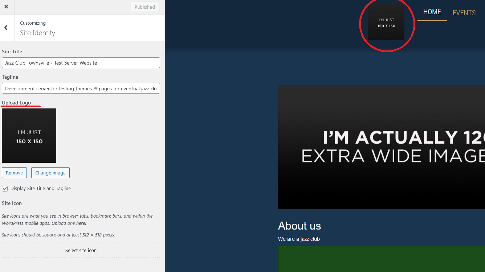

[<-- Back to README](README.md)

# Group 6 Jazzy Theme Documentation
## About this theme

---

This Jazzy theme takes much inspiration from other musical websites and designs and adds them all into one. Creating a more Jazz orientated theme. This theme has plugin implementation for social icons, an easy to create front page and customizer options for the default WordPress customizer.

## Customizer Options

---

Once you are in the WordPress customizer (If you are unsure on how to access the customizer look [here](https://www.wpbeginner.com/beginners-guide/how-to-use-wordpress-theme-customizer/)).

In order to make the most out of the theme, head into **Home Page Settings** and select a static page. The theme works the best with a static page! You can create pages normally, in the WordPress page creator.

Under **Site Identity** you will find options for the site title, tagline, **logo** and the site icon. A unique feature with the *Jazzy Theme* is that this **logo** section will add your desired logo into the navbar. In the case there is no logo selected the website title will be placed there instead. *(We recommend a square image that will fit the header section properly)*



## Menu Options

---

There are 2 different locations menus can be used in this theme. One in the navigation bar and the other in the footer. In order to select which menu to use navigate into the *Menus* section under *Appearance* in the WordPress dashboard.


- **Header bottom menu** is the menu used in the navbar.
- **Footer menu** is the menu used for the footer. *(Note there will always be a "go to top" part and social icons, unless changed in the plugins)*

## Social Icons

---

For the social icons the plugin [Easy Social Icons](https://en-au.wordpress.org/plugins/easy-social-icons/) was used. This allowed for a wide variety of icons to be used easily and quickly. In the *footer.php* you will find the following code.

```
<?php if ( function_exists('cn_social_icon') ) echo cn_social_icon(); ?>
```

This code searches to see if the plugin is active and has icons. If you no longer desire icons or want to change them you can change and/or remove them in the plugin settings found on the WordPress dashboard.
*Easy Social Icons* also has shortcode which can be used in posts!

```
[cn-social-icon]
```

## Styling & Functions

---

The style sheets were created using **SASS** the SASS code is included in the project so if you'd like to edit the CSS that way it is possible, otherwise you can just edit the CSS directly. A lot of the prominent features which are seen throughout the website will be found at the bottom of the CSS.

Likewise for the functions and other WordPress features we kept the _tk functionality relatively the same and added our theme specific functionality to the bottom of the documents for easier access.

## Other  

---

Throughout all of the header, footer, and page php there is comments in there describing what each element does. Do not edit unless you know what you are doing. But if you do know, we kept it self explanatory.

[<-- Back to README](README.md)
